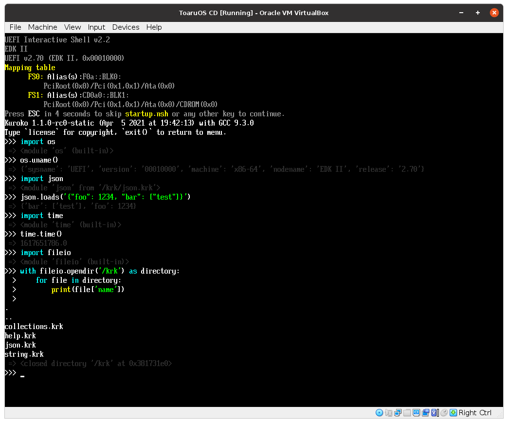

# Kuroko EFI

This repository contains a collection of stubs and native modules for building Kuroko for UEFI (x86-64).

The resulting `cdimage.iso` should work on most x86-64 UEFI systems, but may require manual selection from a shell or boot manager.

